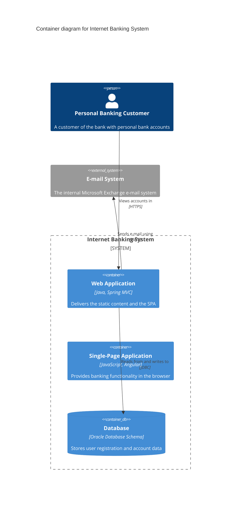

# C4 Model Architecture Documentation

## Overview

Turn a codebase or a verbal architecture description into a documented C4 model: English
Markdown, one editable Mermaid source per diagram, and PNG/SVG renders produced by the
`mermaidx` PyPI package (no browser, no Node.js).

Diagrams are drawn by subagents and accepted by the main agent. The main agent owns the
model - input mode, view selection, aliases, element inventory, per-diagram budgets - and is
the only one that declares a diagram finished. A subagent owns exactly one diagram, iterates
until its checkers are clean, and hands it over with evidence; the main agent then re-runs
the checks and looks at the render itself before accepting.

Geometry is not the deliverable; a reader following an arrow is. The two defects readers
report most are arrows that overlap or bundle so their individual paths cannot be told
apart, and labels sitting where more than one arrow could claim them. A subagent's "clean
run" is a claim about its own file; **the main agent's own re-run and its own look at the
PNG are the evidence**, and no diagram is reported as done before the main agent has done
both.

Before authoring diagrams, read [references/c4-model.md](references/c4-model.md) for the
model itself and [references/mermaid-c4-syntax.md](references/mermaid-c4-syntax.md) for the
exact syntax, escaping rules, and known failure modes.

## Roles and supervision

| Role | Owns | Must not |
| --- | --- | --- |
| Main agent | Input mode, view selection, the shared spec, assignment, acceptance, `docs/c4/README.md`, the final report | Draw a diagram and accept it in the same breath; accept a diagram without re-running the checkers and opening the render |
| Subagent, one per diagram | One `.mmd` source, its renders, its checker output, its own visual pass, its hand-off note | Invent or rename elements, change the model, touch a diagram it does not own, declare a diagram done on geometry alone |

Supervision loop:

1. The main agent writes the shared spec (below) and spawns one subagent per diagram. Give
   every subagent the whole spec, not only its own diagram: aliases and descriptions must
   stay identical across views.
2. Each subagent iterates until its own checks are clean, then opens its own PNG and answers
   the six legibility questions below. It returns a hand-off note that quotes its final
   checker output and its own answers.
3. The main agent re-runs every checker on the delivered files itself, then opens every PNG
   (and the SVG when a label or an arrowhead is doubtful) and answers the same six questions
   itself. A subagent's "clean" is a claim; the main agent's own run and its own look are the
   evidence.
4. The main agent accepts only diagrams that pass both gates. Anything else gets a fix
   request, which is an instruction, not a hint: name the diagram, quote the checker line or
   the defect seen in the render, state the constraint to satisfy, and say what may not
   change.
5. The main agent records one verdict per diagram. Only accepted diagrams are written into
   `README.md` and reported as done; rejected or deferred diagrams are reported as such.

Six legibility questions - answered by the subagent before hand-off and re-answered by the
main agent from the render, never from the source:

1. Can I trace each connector from its source element to its target element without losing
   it?
2. Do any two arrows share a drawn path, run as a tight parallel bundle, or arrive at the
   same point of the same element?
3. Does any arrow pass underneath an element box or a boundary caption?
4. Is every label unmistakably nearer its own arrow than any other arrow, with no foreign
   arrow running through the text?
5. Does any element receive more than three arrows, or any pair of elements carry more than
   one relationship?
6. Is every string inside its box, unclipped, and overlapping no other string?

A "no" on any question is a defect, even when every checker is silent. Restructure the
diagram (see the fix playbook); do not argue the geometry.

Spec block handed to every subagent:

```text
target file:         docs/c4/diagrams/<nn-name>.mmd
system and scope:    <one sentence, identical across the set>
elements:            <alias, name, technology, description - copied exactly, do not edit>
relationships:       <source alias, target alias, label, technology>
budget:              <= 7 relationships, <= 2 crossings, fan-in <= 3, no shared
                     path or bundle between two arrows, no arrow through a box or
                     a label, every label nearer its own arrow than any other
acceptance commands: validate_c4.py, render_c4.py, fit_labels.py --max-shift 24,
                     check_arrows.py, check_layout.py, then the six legibility
                     questions answered from the PNG
deliverable:         hand-off note, no README edits
```

Hand-off note (subagent to main agent):

```text
diagram:            docs/c4/diagrams/<file>.mmd
status:             clean | needs decision
checkers:           validate <result>; fit_labels <result>; check_arrows <result>; check_layout <result>
visual:             answered the six questions by looking at <png path>; <one line per
                    question, including the ones that needed a fix>
elements/relations: <counts>; changed: <list or none>
tried and rejected: <restructurings that did not clear a defect, so the main agent
                    does not repeat them>
open questions:     <what the main agent must decide, or none>
```

Fix request (main agent to subagent):

```text
diagram:         <file>
symptom:         <checker line verbatim, or the defect seen in the render with the
                 region named - "the label between webApp and db">
constraint:      <what must hold after the fix>
allowed changes: <for example: reduce relationships, split the view, <= N elements>
if impossible:   <what to drop or defer instead>
```

Acceptance record (main agent, per diagram, kept for the final report):

```text
diagram:   <file>
checkers:  <main agent's own re-run output - not the subagent's>
visual:    <main agent's answers to the six questions, or "opened <png>, no defect">
verdict:   accepted | rejected: <reason> | deferred: <reason>
```

## Workflow

### Phase 1 - the model (main agent, alone)

1. **Pick the input mode.** A target path in the request means codebase analysis. Only a
   description means authoring from the description, where every element the user did not
   state is an assumption.
2. **Select the views.** Apply the rules in "Level selection" below; do not generate
   diagrams that add no value.
3. **Gather elements with evidence.** In codebase mode, collect aliases, names, technologies,
   descriptions, and the file/config each element came from.
4. **Freeze the shared spec.** Aliases, the element inventory, the relationship set per
   diagram, and a per-diagram budget. Everything the subagents draw comes from this spec, so
   one diagram cannot drift from another.

### Phase 2 - the drawings (one subagent per diagram)

5. **Author one `.mmd` file per diagram** under `docs/c4/diagrams/` and iterate:

   ```bash
   python3 <skill-dir>/scripts/validate_c4.py docs/c4/diagrams                # source lint
   python3 <skill-dir>/scripts/fit_labels.py docs/c4/diagrams/<file>.mmd --apply --max-shift 24
   python3 <skill-dir>/scripts/render_c4.py --src docs/c4/diagrams            # renders the offsets fit_labels wrote
   python3 <skill-dir>/scripts/check_arrows.py docs/c4/diagrams/<file>.mmd   # reads the SVG
   python3 <skill-dir>/scripts/check_layout.py docs/c4/svg/<file>.svg
   ```

   `fit_labels.py --apply` edits the `.mmd`, so the render has to follow it - running the
   checkers against a stale SVG is the easiest way to hand over a defect.

   When a check fails, change the structure - cut a relationship, split the view, reorder
   elements, use a directional hint - rather than fighting the layout; the fix playbook
   below maps each reported kind to the restructuring that clears it.
6. **Look at the render before handing off.** The subagent opens its PNG and answers the six
   legibility questions honestly, including the defects it could not clear. Geometry that
   measures clean and reads badly is still a defect, and it is far cheaper for the subagent
   to find it than for the main agent.
7. **Hand off** with the note above. The subagent does not touch `README.md`.

### Phase 3 - the review (main agent)

8. **Re-run every check yourself** on the delivered files (validate, render, fit_labels dry
   run, check_arrows, check_layout). Do not take the hand-off note on trust.
9. **Look at every render.** Open each PNG in the vision-capable review step (and the SVG
   when a label or an arrowhead is doubtful) and answer the six legibility questions from
   the image. A diagram with clean geometry that fails any of them is rejected.
10. **Accept or send a fix request.** Accept only what passes both the checkers and the visual
   questions. Prefer cutting a relationship over any label offset, and prefer splitting a
   view over crowding one. Write the acceptance record for the diagram.

### Phase 4 - the document (main agent)

11. **Write `docs/c4/README.md`** from
    [assets/c4-doc-template.md](assets/c4-doc-template.md), embedding the accepted PNGs and
    linking the sources. The narrative is written once, by the main agent, so it stays
    consistent across views.
12. **Report** the files produced, the assumptions and open questions, which diagrams were
    rejected and why, and which review checklist items still need a human decision.

## Level selection

| View | When to produce it |
| --- | --- |
| L1 System Context | Always. One diagram for the system in scope, its users, and the external systems it depends on. |
| L2 Container | Always. The deployable/runnable units inside the system, plus technology choices. |
| L3 Component | Only when the code shows cohesive internal parts of one container (packages/modules/classes with distinct responsibilities) and that container matters to the story. Produce one component diagram per container. |
| L4 Code | Only on explicit request or when one component's implementation is the subject. Use a Mermaid `classDiagram`, not C4 syntax. |
| System Landscape | When the system in scope is one of several systems or team boundaries matter. |
| Dynamic | When a runtime flow (sign-in, order, ingestion) must be explained as an ordered interaction. Draw it with a Mermaid `sequenceDiagram` (`autonumber`) rather than `C4Dynamic`: the C4 layout engine produces crossing arrows and drifts labels far from their lines. |
| Deployment | When real deployment topology is readable from IaC/config (compose, k8s, Terraform, systemd). Show placement, not routing. |

c4model.com states that not every level is required; system context and container diagrams
are enough for most teams. Prefer three clear diagrams over seven padded ones.

## Extraction in codebase mode

Collect evidence before inventing boxes:

- **People/actors:** user-facing entry points, role definitions, auth configuration, product docs.
- **Containers:** `Dockerfile`, `docker-compose.yml`, k8s manifests, serverless configs, `pom.xml`, `build.gradle`, `*.csproj`, `go.mod`, `package.json`, `pyproject.toml`, `Cargo.toml`, plus process entry points (`main`, `cmd/`, `bin/`, `src/*/__main__.py`) and independent schedulers/workers.
- **Components:** top-level packages/modules inside one container with a cohesive responsibility; controllers, services, repositories, adapters. Do not create one component per file.
- **External systems:** runtime calls to third-party APIs, identity providers, payment/e-mail services, cloud services, managed queues and databases outside the scope.
- **Relationships:** imports between modules, HTTP/gRPC clients, database access, queue producers/consumers, CLI invocations. Capture the technology (protocol, driver, format) when the code shows it.

Keep evidence out of the diagrams and record it in the Evidence table of
`docs/c4/README.md`. Mark anything inferred rather than observed as an assumption, and list
what the code cannot answer (SLOs, team ownership, cost, non-functional requirements).

## Authoring rules

- Write all diagram text in English, Latin characters only; non-ASCII text renders as missing glyphs.
- Use native Mermaid C4 syntax (`C4Context`, `C4Container`, `C4Component`, `C4Dynamic`, `C4Deployment`) as the first choice.
- Fall back to the C4-styled `flowchart` template in [references/flowchart-fallback.md](references/flowchart-fallback.md) only when native syntax fails or cannot express the layout. Add a `<!-- fallback: <reason> -->` note at the top of the `.mmd` file so the deviation is auditable.
- Name files `00-system-landscape.mmd`, `01-system-context.mmd`, `02-container.mmd`, `03-component-<container>.mmd`, `04-code-<component>.mmd`, `05-dynamic-<flow>.mmd`, `06-deployment.mmd`.
- Use short lowerCamel aliases (`bankingSystem`, `webApp`) that stay stable across regenerations; never renumber aliases that already exist. Aliases come from the main agent's spec, not from the subagent.
- Give every element a short description and every relationship a verb plus technology where known (`Reads/writes`, `JDBC`).
- Keep each diagram between roughly 3 and 12 concrete elements; split anything larger into a second diagram or a lower level.
- Connect every element to at least one other element; an unconnected box is a defect.
  Deployment nodes and infrastructure leaves may be exempted with a
  `%% allow-orphan: <alias>` comment when they exist only to show topology.
- Label placement lives in the `.mmd`, never in the render. `fit_labels.py --apply` writes the
  offsets it can justify as `UpdateRelStyle(...)` lines; a label it leaves alone gets a
  hand-written offset in the same syntax. Never edit the SVG or the PNG, and re-render after
  every source edit so source and render stay in step.

## Legibility rules

These rules come from measuring rendered output and from reader feedback: a diagram whose
arrows and labels cannot be followed is not documentation. Follow them before reaching for
layout tweaks.

1. **One story per diagram.** 3-12 concrete elements, at most 7 relationships, at most 3
   arrows into any one element. Split the view when you exceed a budget.
2. **Every arrow is individually traceable.** No two arrows may share a drawn path
   (`edge-overlap`), run as a tight bundle under `--parallel-distance` for more than
   `--max-parallel` (`edge-bundle`), or land on the same point of the same element
   (`shared-arrowhead`). Two relationships drawn as one line is a modelling defect: merge
   them into one labelled relationship, cut the weaker one, or split the view.
3. **Arrows never run under a box.** `edge-through-box` fires when a connector is hidden
   beneath an element box or a caption; the reader cannot tell what it connects. Reorder the
   elements or the relationships so the path stays in open space.
4. **Every label belongs to its own arrow.** `check_arrows.py` fails a label that is closer
   to another arrow than to its own, more than `--max-label-distance` (default 30px) from its
   own arrow, or with another arrow running through its text box
   (`label-crossed-by-arrow`). It also fails genuine equidistance: a second arrow within
   `--ambiguity-margin` (default 3px) *and* close enough to be a plausible owner. Ambiguity
   is an error, not a warning: if a reader could attach a label to the wrong arrow, the
   diagram is wrong even when nothing overlaps. A label 2px from its own arrow and 8px from
   a neighbour is fine and must not be "fixed" into something worse.
5. **Crossings are errors, not aesthetics.** At most 2 arrow crossings per diagram, and never
   a crossing that carries labels. Fix by cutting a relationship, splitting the view,
   reordering elements with `UpdateLayoutConfig`, or using `Rel_Up`/`Rel_Down`/`Rel_Left`/
   `Rel_Right` hints.
6. **Fix ownership by structure, never by distance.** `fit_labels.py --max-shift 24` may only
   nudge a label within 24px of its line. When it reports labels still colliding, restructure
   the diagram instead of raising the budget: a label parked 70px away is collision-free and
   unreadable.
7. **Keep the canvas compact.** Use `assets/mermaid-config.json` (`c4ShapeMargin` 50).
   Inflating margins to avoid collisions makes the diagram several times taller, and text
   looks tiny whenever the image is scaled to fit.
8. **Pick the view type that fits the content.** Static structure uses native C4 syntax;
   ordered flows use `sequenceDiagram` (`autonumber`); code uses `classDiagram`. `C4Dynamic`
   produces crossing arrows with labels far from their lines - do not use it.
9. **Deployment diagrams show placement, not routing.** Do not put an actor in a deployment
   diagram (its long relationship line crosses boundary captions), and do not restate the
   routing that the container diagrams already carry: keep a handful of cross-node
   relationships and let placement be the story.
10. **Keep labels short.** Aim for under ~30 characters plus the technology tag; long labels
   force large offsets and start colliding with neighbouring text.
11. **Never paint opaque shapes over text.** White label "plates" and text halos look like
   blocks covering words and cannot be verified reliably. Move the label instead.
12. **Export at scale 2.** Text lands at 24-32px in the PNG; `--width` overrides the scale and
    is only for diagrams viewed fit-to-width.

### Fix playbook

Choose the fix by defect, in this order of preference: cut the relationship, merge it, split
the view, reorder, then nudge. Raising a threshold to silence a checker is not a fix.

| Checker kind | Structural fix |
| --- | --- |
| `edge-overlap` | Two relationships between the same pair, or two arrows forced down one corridor: merge into a single labelled relationship, cut the weaker one, or move one relationship to a different view where it is the subject. |
| `edge-bundle` | More arrows than the layout has lanes: cut a relationship, pull the source elements further apart with `UpdateLayoutConfig($c4ShapeInRow=...)`, or split the fan into two views. |
| `shared-arrowhead` | Two relationships ending on the same element from the same side: give one a different target (does the data really go to that element?), or use `Rel_Back`/`Rel_Up`/`Rel_Down` to separate the entry sides. |
| `edge-through-box` | Reorder the elements so the corridor between source and target is empty; if no order is free, the diagram carries too many relationships - cut one. |
| `label-on-arrow` | Run `fit_labels.py --apply` first; for the labels it reports as still colliding, add `UpdateRelStyle(<source>, <target>, $offsetX="0", $offsetY="-20")` to the `.mmd` and re-render. Keep the offset small and perpendicular to the line, and re-read the render: an offset big enough to escape one arrow can park the label on its neighbour. |
| `label-crossed-by-arrow`, `label-ambiguous`, `label-foreign`, `label-detached` | Shorten the label first; if it still lands between two arrows, remove the relationship that supplies the second arrow, or split the view. Never move the label far from its line to escape a neighbour. |
| `fan-in` | Four or more arrows into one element means that element is the story: introduce an explicit intermediate element, split it by concern, or show the fan in a lower-level view. |
| `edge-crossings` | Reorder with `UpdateLayoutConfig`, then separate with directional hints, then cut a relationship. A crossing that carries a label is never acceptable. |
| `unmatched-edge` | Two elements share a name: make descriptions distinct so each connector can be paired with its relationship. |

### Verification loop

```bash
python3 <skill-dir>/scripts/validate_c4.py docs/c4/diagrams       # source lint + render smoke test
python3 <skill-dir>/scripts/fit_labels.py docs/c4/diagrams --apply --max-shift 24  # writes offsets into the .mmd
python3 <skill-dir>/scripts/render_c4.py --src docs/c4/diagrams   # PNG + SVG + manifest, after fit_labels
python3 <skill-dir>/scripts/check_arrows.py docs/c4/diagrams     # arrow overlap/bundles, label ownership, crossings, fan-in
python3 <skill-dir>/scripts/check_layout.py docs/c4/svg          # overlap, clipping, box overflow
```

Repeat until `check_arrows.py` and `check_layout.py` are both silent *and* a visual pass
confirms that every arrow can be traced on its own and no text is covered, overlapped, or
clipped. Geometry alone does not catch every defect; the subagent answers the six questions
before hand-off, and the main agent answers them again from the PNG before accepting.

## Minimal example



## Validation

Run `scripts/validate_c4.py` before every render. It reports, per file and line:

- hard errors: missing or duplicated diagram header, missing title, duplicate aliases, relationships pointing at boundaries or undeclared aliases, HTML entities on the `title:` line, boundary nesting deeper than three, render failure;
- warnings: non-ASCII text, orphan elements, elements without a description, non-native syntax.

Fix hard errors and review warnings before rendering; render failures include the applicable
workaround from [references/mermaid-c4-syntax.md](references/mermaid-c4-syntax.md).

Run `scripts/check_arrows.py` after rendering. It pairs each relationship in the source with
its drawn connector, measures the drawn geometry, and reports:

- `label-on-arrow`: the label's own connector is drawn through the text. Mermaid's native C4
  layout puts a relationship label on the line by default, so this is the most common
  defect and the reason `fit_labels.py` runs before the checks;
- `label-foreign`, `label-detached`, `label-ambiguous`: a label belongs to another arrow,
  has drifted off its own (`--max-label-distance`, default 30px), or sits within
  `--ambiguity-margin` (default 8px) of a second arrow - the case where a reader sees text
  between two arrows and cannot tell which one it names;
- `label-crossed-by-arrow`: another connector runs through the label's text box;
- `edge-overlap`: two arrows are drawn along the same path for more than `--max-overlap`
  (default 16px), so two relationships look like one line;
- `edge-bundle`, `shared-arrowhead`: two arrows stay within `--parallel-distance` (default
  8px) for longer than `--max-parallel` (default 60px), or land on the same point of the same
  element, so their heads cannot be told apart;
- `edge-through-box`: a connector is hidden underneath an element box, which hides both the
  arrow and the text it crosses;
- `edge-crossings`, `fan-in`: the diagram has more crossings or converging arrows than the
  budget allows (`--max-crossings` 2, `--max-fan-in` 3);
- `unmatched-edge`: a relationship could not be paired with a connector - usually a sign that
  two elements share a name and need clearer descriptions.

Every kind above is error-level: the checker exits 1 so a diagram with an ambiguous label or
two arrows on one path cannot be reported as clean. Thresholds are tunable for a specific
project, but relaxing one is a decision the main agent makes and records, never a step a
subagent takes to turn a check green.

## Rendering

```bash
python3 <skill-dir>/scripts/render_c4.py --src docs/c4/diagrams
```

Defaults: PNG at `docs/c4/png/`, SVG at `docs/c4/svg/`, manifest at `docs/c4/manifest.json`,
`scale=2.0`, white background, `default` theme. The script:

1. imports `mermaidx`, or installs it with `python3 -m pip install mermaidx -i https://pypi.org/simple` (some corporate/mirror indexes do not carry the package; on a PEP 668 "externally managed" system, create a venv and run the scripts with it instead);
2. renders each `.mmd` to PNG and SVG using `assets/mermaid-config.json`, which widens the C4 shape margin so relationship labels have room (`--config` overrides it, `--no-config` disables it);
3. skips diagrams whose source hash and render options both match the manifest, unless `--force` is given;
4. records dimensions, paths, and render status in `manifest.json`.

Use `--check-only` to validate rendering without writing output, and `--scale`, `--width`/
`--height`, `--theme`, and `--background` to change the raster output. Keep the default
`--scale 2` for documentation: it puts label text at roughly 24-32 pixels in the PNG, so the
file is readable at 100% zoom. The script warns when a render drops below 1.5 image pixels
per diagram pixel (text too small) or grows wider than 6000px (file too heavy). Passing
`--width` overrides the scale and is only worth it when a diagram is meant to be viewed
fit-to-width.

Readability comes from the diagram's own size, not from the export resolution: a wide C4
diagram always needs zooming when it is scaled to fit a page. When a diagram is still hard to
read, split it (one story per diagram), shorten element descriptions, or link the SVG - it
stays crisp at any zoom.

Manual fallback if the script cannot be used:

```bash
python3 -m pip install mermaidx -i https://pypi.org/simple
mermaidx -i docs/c4/diagrams/02-container.mmd -o docs/c4/png/02-container.png --scale 2 -b "#ffffff"
```

## Output contract

Write only inside the target project:

```
docs/c4/
├── README.md          # index, narrative, evidence table, assumptions
├── diagrams/*.mmd     # editable Mermaid sources (committed)
├── png/*.png          # PNG renders referenced by README.md
├── svg/*.svg          # vector renders for editing and high-resolution use
└── manifest.json      # source hashes, render status, image dimensions
```

Embed images with relative paths, for example ``.
Subagents write only their own `.mmd` file; the main agent owns `README.md` and the final
render pass.

## Verified pitfalls

These were reproduced against mermaid.js v11 through `mermaidx`; the same rules apply to any
Mermaid C4 renderer.

- Relationships must target concrete elements, never boundary aliases: `Rel(app, deploymentNode, ...)` and `Rel(user, systemBoundary, ...)` abort with `TypeError: cannot read property 'x' of undefined`.
- A `Deployment_Node` that directly contains a `Container` renders, but adding a relationship that points at that node fails. Nest a `Deployment_Node` inside it, or use the flowchart fallback.
- Never put HTML entities such as `&amp;` on the `title:` line (lexical error); a raw `&` is fine. Entities are fine inside quoted labels and descriptions.
- Keep labels Latin-only: `mermaidx` bundles DejaVu Sans, so CJK characters become tofu boxes.
- Quote every label/description and use `<br/>` for line breaks inside them.
- Use `UpdateLayoutConfig($c4ShapeInRow="3", $c4BoundaryInRow="1")` to control native C4 layout; there is no `direction` keyword in C4 diagrams.
- A wrapped label is one `<text>` per line sharing a single `y`, with the line offset in the tspan `dy`. Both checkers model that; a geometry script that reads only `y` reports every two-line label as overlapping itself.

## Resources

- [references/c4-model.md](references/c4-model.md) - abstractions, diagram types, notation, and the review checklist.
- [references/mermaid-c4-syntax.md](references/mermaid-c4-syntax.md) - keywords, escaping rules, working examples, failure modes.
- [references/flowchart-fallback.md](references/flowchart-fallback.md) - C4-styled flowchart templates for unsupported cases.
- [assets/c4-doc-template.md](assets/c4-doc-template.md) - template for the generated `docs/c4/README.md`.
- `scripts/validate_c4.py`, `scripts/render_c4.py` - validation and rendering.
- `scripts/check_arrows.py`, `scripts/check_layout.py`, `scripts/fit_labels.py` - arrow overlap and bundling, label ownership, crossings and fan-in, text geometry, bounded label fitting.
