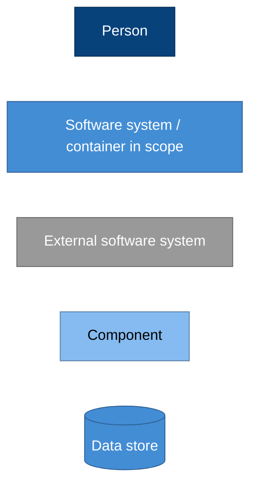
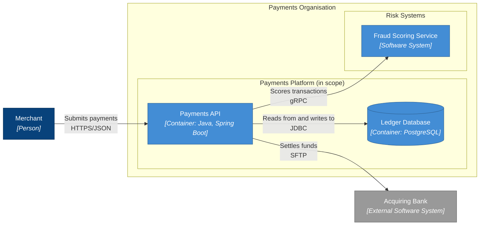
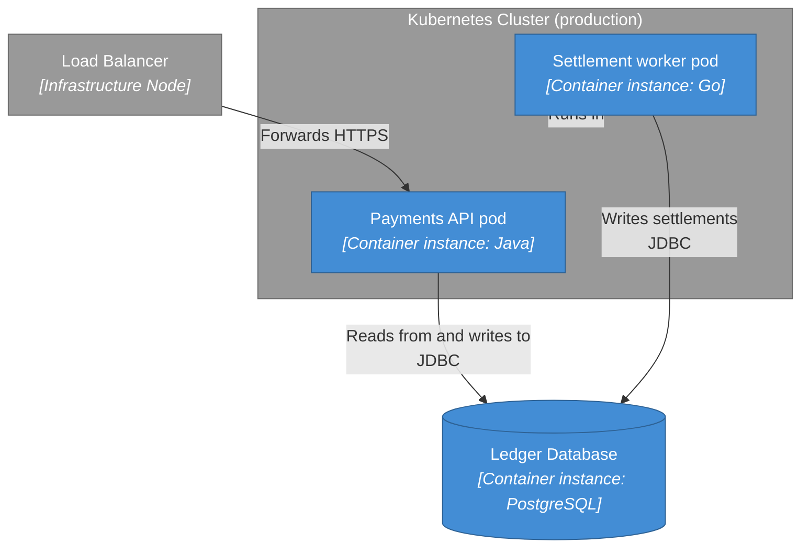
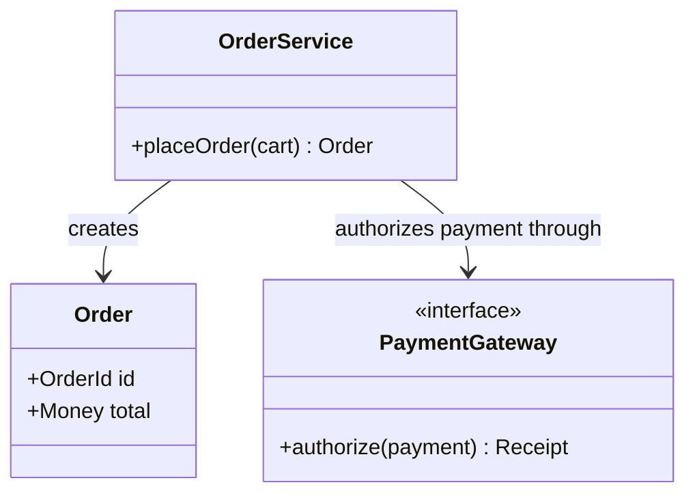

# C4-Styled Flowchart and Class Fallbacks

Use a plain Mermaid flowchart when native C4 syntax cannot express the diagram, and
a class diagram for L4 code views. The fallback keeps C4 semantics (same
abstractions, same colours, same labels) while giving full control over layout.

## Contents

- [When to use a fallback](#when-to-use-a-fallback)
- [Required conventions](#required-conventions)
- [C4 colour palette](#c4-colour-palette)
- [Templates](#templates)
- [L4 code diagrams](#l4-code-diagrams)

## When to use a fallback

- A relationship must point at a boundary or at a deployment node (native C4
  aborts; see [mermaid-c4-syntax.md](mermaid-c4-syntax.md)).
- A deployment diagram needs a node that directly contains containers and also
  participates in relationships.
- Layout control is essential: horizontal bands, fixed grouping, or a very wide
  system landscape that the C4 layout engine cannot express.
- The diagram needs element annotations that native C4 keywords cannot carry
  (status badges, ownership, cost, plan symbols).

Always record the deviation at the top of the `.mmd` file:

```text
%% title: System landscape for Payments Platform
%% fallback: native C4 cannot relate deployment nodes to their containers
```

The `%% title:` comment is mandatory for fallback diagrams; `validate_c4.py`
enforces it and then skips the native C4 semantic checks.

## Required conventions

- Keep the same abstractions and vocabulary as the C4 diagrams; do not invent new
  element types.
- One `subgraph` per boundary, named `<Boundary name>` (for example
  `subgraph banking["Internet Banking System"]`).
- Node ids match the aliases used elsewhere in the documentation so the generated
  docs stay searchable and stable across regenerations.
- Labels follow the native pattern: `<Name><br/><i>[Type]</i><br/><i>Technology</i>`
  with the description as a final `<br/>`-separated line when it fits.
- Edges are unidirectional and labelled: `a -->|"Sends e-mail using<br/>SMTP"| b`.
- English/ASCII text only, same as native diagrams.

## C4 colour palette

The palette mirrors the C4 example diagrams, so fallback and native diagrams look
consistent within one documentation set.



Element shapes: rectangles (`[...]`) for people, systems, and containers;
rounded corners (`(...)`) for components; cylinder (`[(...)]`) for data stores;
hexagon (`{{...}}`) for queues/topics; dashed borders via `stroke-dasharray: 5 5`
for external elements you want to distinguish by line style instead of colour.

## Templates

System landscape with boundaries:



Deployment fallback where a node must be a relationship endpoint:



## L4 code diagrams

Use a Mermaid `classDiagram` for code-level views; C4 has no code-level syntax and
auto-generated diagrams go stale quickly.



Keep code diagrams scoped to one component, show only the types needed for the
story, and note in the document that they are illustrative rather than exhaustive.
