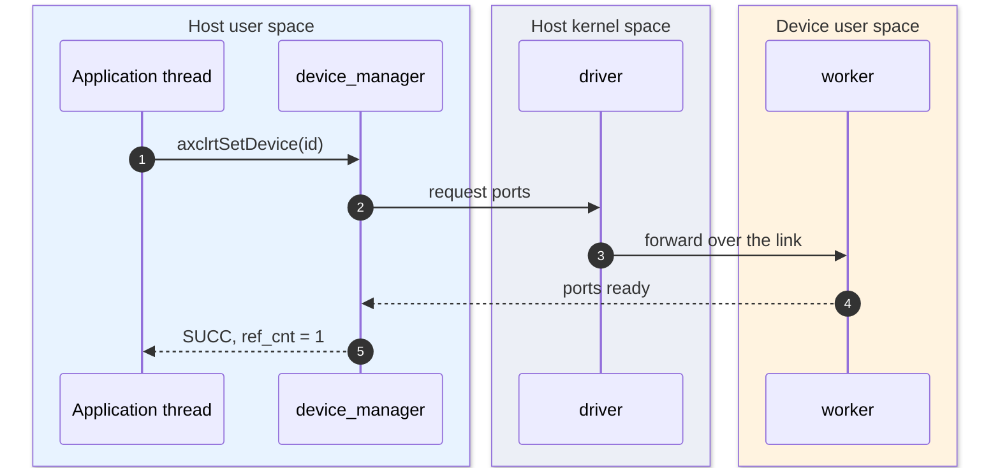
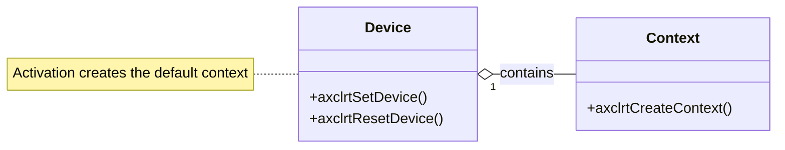
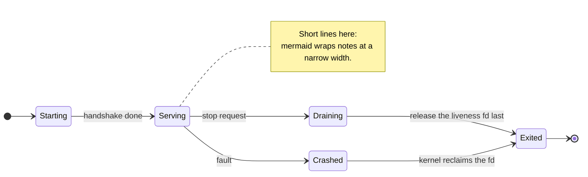
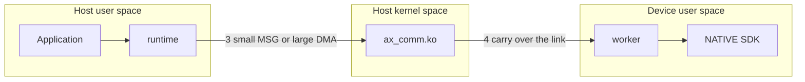
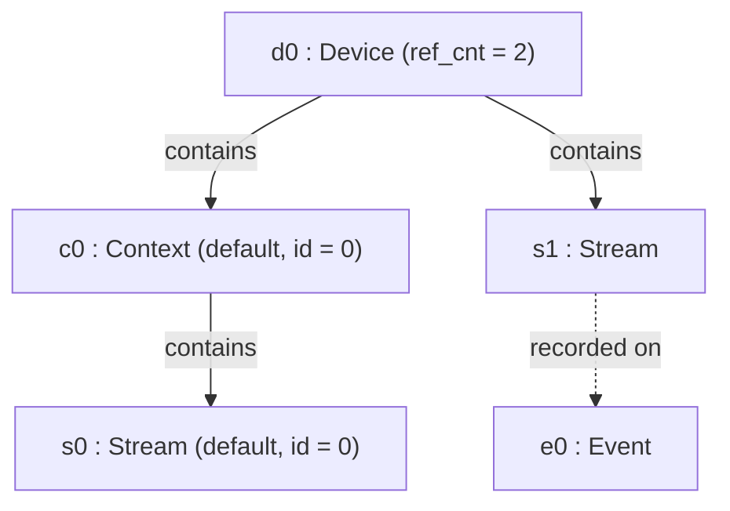

# On-Demand Interaction, Code, State and Flow Views

C4 stops at components. Call ordering, object methods, lifecycles and cross-boundary paths
have no C4 home, so this skill adds them only when the repository's design docs raise a
question the structure views cannot answer. Every file here is a deliberate view choice:
record why it exists in `docs/c4/README.md`, next to the evidence for its elements.

## Contents

- [Conventions](#conventions)
- [Dynamic view: sequence with boxes](#dynamic-view-sequence-with-boxes)
- [Code view: class diagram](#code-view-class-diagram)
- [State view: state machine](#state-view-state-machine)
- [Flow view: swimlane](#flow-view-swimlane)
- [Object view: instance snapshot](#object-view-instance-snapshot)
- [Verification per view type](#verification-per-view-type)

## Conventions

- Front matter title, then a `%% fallback:` note saying why this view type, then the diagram:

  ```text
  ---
  title: State diagram for the device worker lifecycle
  ---
  %% fallback: a lifecycle is drawn as a state machine, not as C4 syntax
  stateDiagram-v2
  ```

- English, Latin characters only; short single-line labels, `<br/>` when a label must break.
- One story per diagram. If two flows or two lifecycles compete for the canvas, split them.
- Trace every element to a file, a doc section or a symbol; the README evidence table carries
  the reference. Anything you cannot trace is an assumption, and assumptions go in the
  assumptions table, not into the diagram as fact.
- Check with `validate_c4.py`, `render_c4.py` and `check_layout.py`; `check_arrows.py` applies
  to C4 structure views only and passes the rest with "no C4 relationships".

## Dynamic view: sequence with boxes

Use when ordering matters: activation, request paths, callbacks, shutdown. Put each space in
a `box`; the box headers become the swimlanes.



Rules: keep the numbered path readable left to right, use `-->>` for replies, and treat any
participant that exists only to relay as a hop the reader must be able to name. Colour the
boxes consistently across the set so the same space is the same colour everywhere.

## Code view: class diagram

Use when the object model and its methods are the subject - the one thing C4 cannot express.



Rules: one class per concept, methods that actually exist in the interface, composition for
ownership, association for the cross-cutting links, and notes for rules that are neither
(default objects, destruction order). A relation label must not collide with a cardinality -
drop the far-end multiplicity before you invent a long label.

## State view: state machine

Use when a lifecycle has branches a reader must not miss: start and exit paths, drain
sequences, offline or failure states.



Rules: every state reachable, every non-final state has an exit, one meaning per state, and
the transition label is the trigger rather than the mechanism. Notes carry the invariants
("the fd is released last") and keep their lines short, because Mermaid wraps note text into
a narrow column.

## Flow view: swimlane

Use when the question is *where* work happens: which space, process or boundary.



Rules: one subgraph per space, `direction TB` inside each lane, numbered edge labels for the
path, and **no back edges** - a return edge drags its source lane to the far left and destroys
the reading order. Reply paths belong in the dynamic view. Write comparisons in words
("small MSG or large DMA"): a raw `<=` is parsed as the start of an HTML tag and silently
eaten.

## Object view: instance snapshot

Use when a concrete instance explains the rules better than the type model: default objects,
mirrors, what is queued, what is waiting.



Rules: name every box `<id> : <Type>` and put the state that matters in brackets; keep the
link labels to the verbs a reader needs (contain, queue, record, wait, manage) and drop the
rest. A snapshot is one moment: do not mix two scenarios into one object diagram.

## Verification per view type

| View | validate | check_layout | check_arrows | Visual pass |
| --- | --- | --- | --- | --- |
| Sequence with boxes | non-native INFO, title required | yes | skipped | step order, box colouring, reply arrows |
| Class | non-native INFO, title required | yes, including `em`-based text | skipped | method lists readable, labels clear of cardinalities |
| State | non-native INFO, title required | yes | skipped | every branch reachable, notes not wrapping into a wall |
| Swimlane | non-native INFO, title required | yes | skipped | lanes in one direction, no back edge, numbered steps |
| Object | non-native INFO, title required | yes | skipped | every box traceable to a type, links unambiguous |

The two failure modes worth remembering, because both look like a broken diagram rather than
a broken tool: a back edge in a swimlane reorders the lanes, and a `.mmd` that starts with
front matter needs the validator's front-matter support (it is built in - do not "fix" it by
moving the header above the title).
