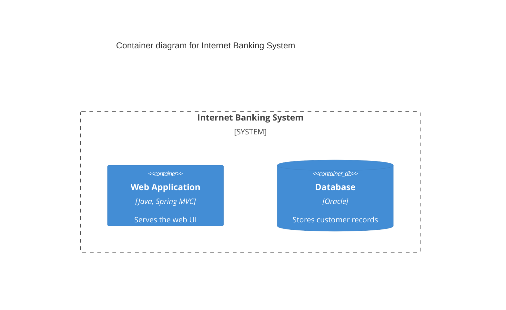
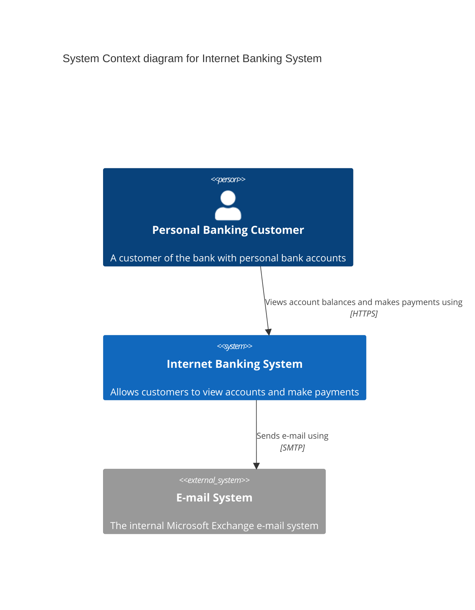
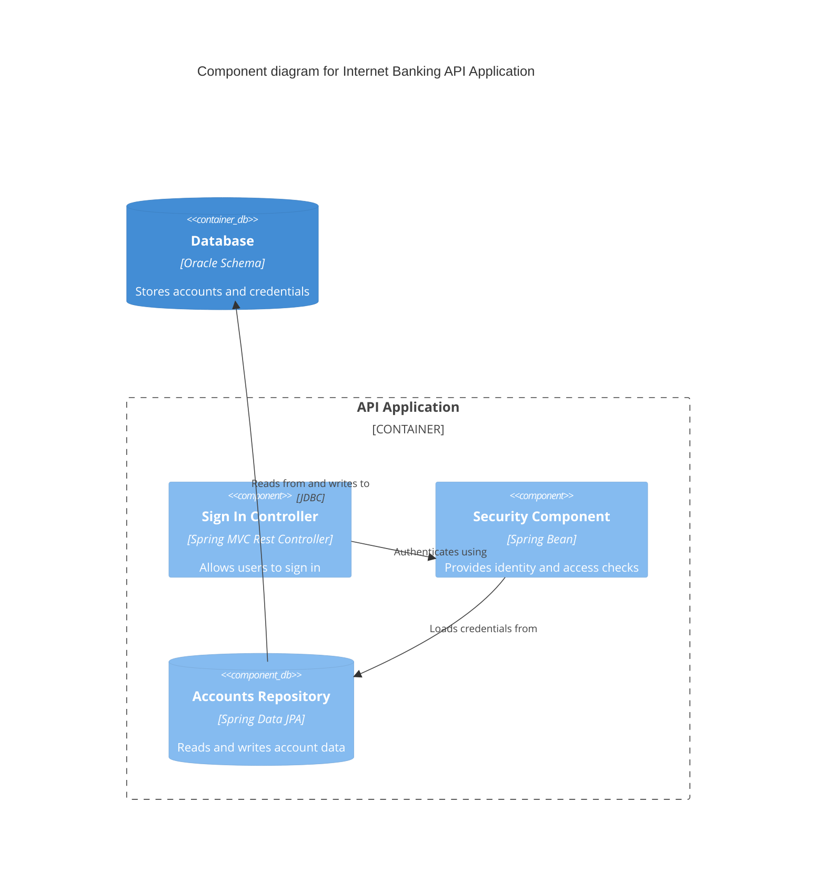
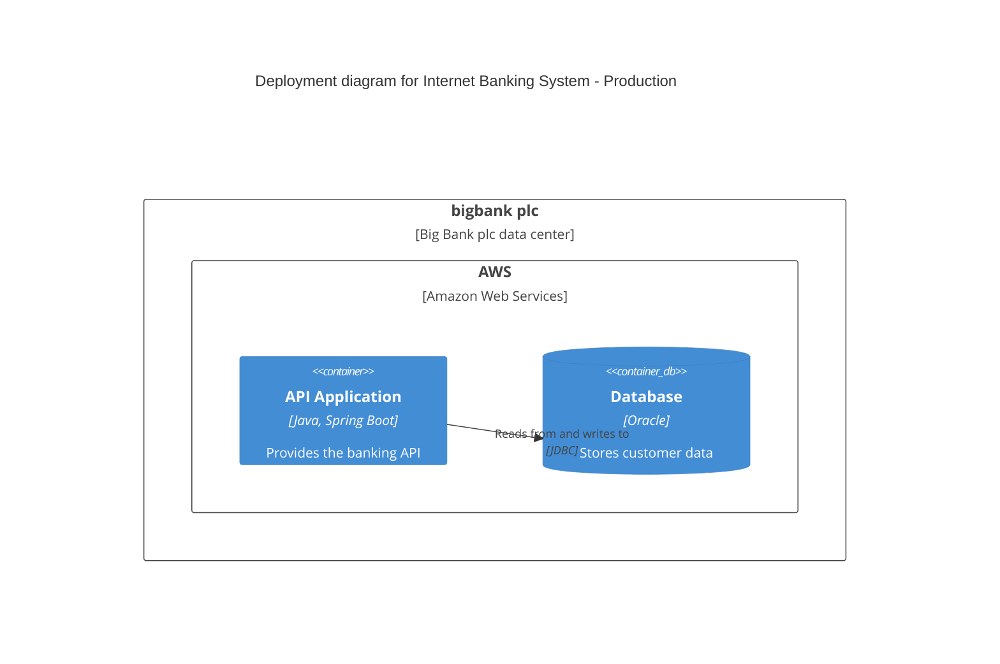

# Mermaid C4 Syntax Reference

Syntax, escaping rules, and verified failure modes for the native Mermaid C4
diagrams used by this skill (mermaid.js v11 through `mermaidx`).

## Contents

- [Diagram headers](#diagram-headers)
- [Element keywords](#element-keywords)
- [Boundaries](#boundaries)
- [Relationships](#relationships)
- [Style and layout directives](#style-and-layout-directives)
- [Escaping rules](#escaping-rules)
- [Verified failure modes](#verified-failure-modes)
- [Working examples](#working-examples)
- [Rendering](#rendering)
- [Layout tips](#layout-tips)

## Diagram headers

| Header | Use for | Maps to |
| --- | --- | --- |
| `C4Context` | System context, and system landscape diagrams. | L1 / landscape |
| `C4Container` | Containers inside one software system. | L2 |
| `C4Component` | Components inside one container. | L3 |
| `C4Dynamic` | Numbered runtime interactions for one flow. | Dynamic |
| `C4Deployment` | Deployment nodes and container instances per environment. | Deployment |

Exactly one header per file, as the first statement. Add `title <text>` directly
after it. Level 4 (code) uses a plain Mermaid `classDiagram` instead - see
[flowchart-fallback.md](flowchart-fallback.md).

## Element keywords

All element declarations follow
`Keyword(alias, "Name", "Technology", "Short description")`; the alias is used by
relationships and must be unique in the file.

| Keyword | Renders as |
| --- | --- |
| `Person(alias, "Name", "Description")` | Person (internal/known user). |
| `Person_Ext(...)` | Person outside the modelled scope. |
| `System(alias, "Name", "Description")` | Software system in scope. |
| `System_Ext(...)` | External software system (grey/blue dashed styling). |
| `SystemDb(...)`, `SystemDb_Ext(...)` | Software system that is a data store. |
| `SystemQueue(...)`, `SystemQueue_Ext(...)` | Software system that is a queue/topic. |
| `Container(alias, "Name", "Technology", "Description")` | Application container. |
| `Container_Ext(...)` | Container outside the scope. |
| `ContainerDb(...)`, `ContainerDb_Ext(...)` | Database/schema or other store container. |
| `ContainerQueue(...)`, `ContainerQueue_Ext(...)` | Queue/topic container. |
| `Component(alias, "Name", "Technology", "Description")` | Component inside a container. |
| `Component_Ext(...)` | Component outside the container boundary. |
| `ComponentDb(...)`, `ComponentDb_Ext(...)` | Component that is a data store. |
| `ComponentQueue(...)`, `ComponentQueue_Ext(...)` | Component that is a queue/topic. |
| `Deployment_Node(alias, "Name", "Type", "Description")` | Deployment node; may be nested. |
| `Node(alias, "Name", "Type", "Description")`, `Node_L`, `Node_R` | Generic deployment nodes with left/right orientation. |

## Boundaries

Boundaries group elements visually; they are not elements and cannot be
relationship endpoints.



| Keyword | Use for |
| --- | --- |
| `Enterprise_Boundary(alias, "Name")` | Organisation/enterprise scope. |
| `System_Boundary(alias, "Name")` | A software system's boundary inside a context/container diagram. |
| `Container_Boundary(alias, "Name")` | A container's boundary inside a component diagram. |
| `Boundary(alias, "Name", "Type")` | Generic boundary (for example a deployment environment). |

## Relationships

```text
Rel(sourceAlias, targetAlias, "Label", "Technology")
```

- Third argument: the intent of the relationship, with direction ("Sends e-mail
  using", "Reads from and writes to").
- Fourth argument: technology/protocol where known (`HTTPS/JSON`, `JDBC`, `AMQP`);
  omit it if the relationship is within one process.

| Keyword | Meaning |
| --- | --- |
| `Rel(a, b, "label", "tech")` | Unidirectional relationship from a to b. |
| `BiRel(a, b, ...)` | Bidirectional relationship. |
| `Rel_Back(a, b, ...)` | Relationship drawn in the reverse direction. |
| `Rel_Up`, `Rel_Down`, `Rel_Left`, `Rel_Right` | Relationship with a directional hint. Use one when two relationships would otherwise leave a shape on the same side and cross. |

## Style and layout directives

```text
UpdateElementStyle(alias, $fontColor="#ffffff", $bgColor="#1168BD", $borderColor="#0b5394")
UpdateRelStyle(sourceAlias, targetAlias, $textColor="#d32f2f", $lineColor="#d32f2f", $offsetX="-40", $offsetY="-20")
UpdateLayoutConfig($c4ShapeInRow="3", $c4BoundaryInRow="1")
```

- `UpdateElementStyle` accepts `$fontColor`, `$bgColor`, `$borderColor`,
  `$shadowing`, `$shape`, `$legendText`, `$legendOrder`.
- Use `$offsetX`/`$offsetY` in `UpdateRelStyle` to pull busy relationship labels
  away from lines; C4 diagrams have no automatic label placement control.
- Use `UpdateLayoutConfig` to control how many shapes/boundaries sit per row.

## Escaping rules

| Context | Rule |
| --- | --- |
| `title` line | Plain text only. A raw `&` is fine; HTML entities such as `&amp;` cause a lexical error. |
| Element labels/descriptions | Quote them. Raw `&`, HTML entities, `\n`-free `<br/>` line breaks, escaped quotes (`\"`), and UTF-8 punctuation are accepted, but keep to ASCII letters. |
| Aliases | `[A-Za-z_][A-Za-z0-9_]*`, unique per file, stable across regenerations (lowerCamelCase). |
| Non-Latin text | Avoid. `mermaidx` bundles DejaVu Sans only, so CJK/Arabic/Cyrillic-adjacent glyphs may render as tofu boxes. |
| Commas | Commas inside quoted labels are safe; the parser splits on top-level commas only. |

## Verified failure modes

Reproduced with mermaid.js v11 via `mermaidx` 0.9.5:

| Symptom | Cause | Fix |
| --- | --- | --- |
| `TypeError: cannot read property 'x' of undefined` | A `Rel` endpoint is a boundary alias (`System_Boundary`, `Container_Boundary`, `Boundary`, `Enterprise_Boundary`). | Point the relationship at a concrete element inside the boundary, or draw the boundary relationship as a separate `Boundary` element in a flowchart fallback. |
| Same error with a deployment diagram | A `Deployment_Node` directly contains a `Container`, and a relationship targets that node. | Nest a `Deployment_Node` inside the outer node and relate containers to each other, or use the flowchart fallback. Deployment nodes that contain only other deployment nodes, or that contain containers without a relationship to the node itself, render fine. |
| `Lexical error ... Unrecognized text` on line 2 | HTML entity or stray text on the `title:` line. | Remove entities; write "and" instead of `&amp;`. |
| Blank boxes in the PNG | Non-Latin characters. | Rewrite the label in English/Latin text. |
| Elements in the wrong order or a sprawling layout | C4 provides no `direction` keyword. | Use `UpdateLayoutConfig`, split the diagram, or fall back to a styled flowchart. |

## Working examples

System context:



Component diagram:



Deployment (nested nodes, no relationship to the node itself):



## Rendering

```bash
python3 <skill-dir>/scripts/validate_c4.py docs/c4/diagrams
python3 <skill-dir>/scripts/render_c4.py --src docs/c4/diagrams
```

`render_c4.py` installs `mermaidx` on demand with
`python3 -m pip install mermaidx -i https://pypi.org/simple` (mirror indexes often
lag) and writes PNG + SVG + `manifest.json`. Direct CLI equivalent:

```bash
mermaidx -i docs/c4/diagrams/02-container.mmd -o docs/c4/png/02-container.png --scale 2 -b "#ffffff"
```

## Layout tips

- Lead with a stable left-to-right or top-to-bottom story: users first, then the
  system, then its stores and external systems.
- Prefer `UpdateLayoutConfig($c4ShapeInRow="3")` over fighting the automatic layout.
- Wrap long descriptions at 60-80 characters using `<br/>`; native C4 boxes do not
  reflow text.
- Keep at most three nesting levels of boundaries; deeper nesting is unreadable and
  is rejected by the validator.
- Mermaid places relationship labels on the edge path, so they regularly land on
  top of element boxes. Keep `c4ShapeMargin` at its default (`assets/mermaid-config.json`
  uses 50) and fix the residual collisions with `scripts/fit_labels.py` instead of
  inflating the margins - large margins make the canvas several times taller, which
  makes the text look tiny when the image is scaled to fit a page.
- Never let `fit_labels.py` become the way you solve a crowded diagram. Its budget is
  capped (`--max-shift`, 24px in the documented workflow) because a label that travels
  further stops reading as part of its own connector. When it reports labels still
  colliding, the diagram has too many relationships: cut one, split the view, or move
  the relationship to a supporting view.
- Run `scripts/check_arrows.py` after `fit_labels.py`. It pairs each relationship with
  its drawn connector and fails a label that ended up closer to another arrow
  (`label-foreign`), a label that drifted off its own (`label-detached`), and diagrams
  with too many crossings or arrows converging on one element (`edge-crossings`,
  `fan-in`).
- Two relationships between the same pair of shapes, and two elements that share a name
  (`ax_comm.ko` on the host and on the device), both make the diagram hard to read and
  the checkers harder to trust: give the elements distinguishing descriptions and keep
  labels unique.

### C4 layout configuration

`mermaidx` forwards a mermaid config dictionary (`render(..., config=...)`, CLI
`-c config.json`), so the C4 layout can be tuned without touching the diagram
source. The knobs that matter here:

| Key | Default | Effect |
| --- | --- | --- |
| `c4ShapeMargin` | 50 | Space between shapes; room for relationship labels. Raising it to 200 removes most collisions but makes the diagram 2-3x taller. |
| `c4ShapePadding` | 20 | Padding inside each box; raise it if descriptions touch the borders. |
| `c4ShapeInRow` | 4 | Shapes per row; lowering it produces a narrower, taller diagram. |
| `c4BoundaryInRow` | 2 | Boundaries per row. |
| `diagramMarginX` / `diagramMarginY` | 50 / 10 | Canvas margin around the diagram. |
| `messageFontSize` | 12 | Relationship label size. |
| `wrap` / `wrapPadding` | true / 10 | Automatic wrapping of long labels. |

The skill ships `assets/mermaid-config.json` with a compact layout (margin 50) and
relies on `scripts/fit_labels.py` for the collisions that remain. `render_c4.py`
applies the config by default (`--no-config` disables it, `--config` overrides it)
and records it in `manifest.json`.

### Layering fix applied at render time

Mermaid emits one group holding both the relationship paths and their labels, and
paints it after the node groups, so line stubs and arrow heads end up on top of
element boxes and boundary captions. `render_c4.py` rewrites the SVG before
rasterizing it: the group is split, connectors are painted first (so boxes hide
them), and the labels stay last. The step is recorded in `manifest.json`.

Two tempting fixes do not work and should not be reintroduced:

- `paint-order: stroke` text halos - mermaidx does not inject user CSS into C4
  diagrams, and resvg ignores the attribute when it is written into the SVG
  directly (verified by measuring pixels: no change at all).
- Opaque white rectangles behind labels - they hide the connector line, but they
  also cover neighbouring text whenever a label sits close to another run, which
  is far worse than a line crossing a label. Keep the source-side fix instead:
  shorten labels, or move them with `UpdateRelStyle` offsets.
